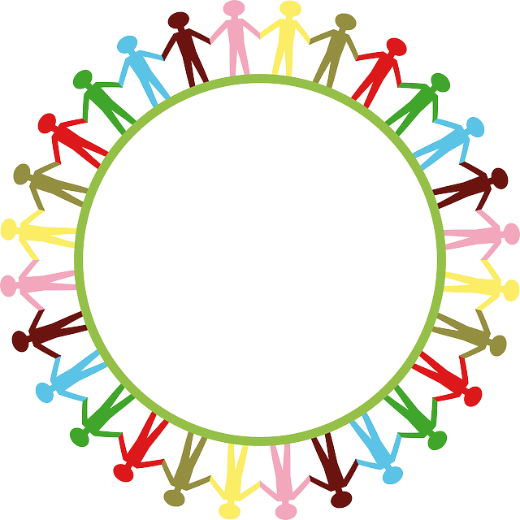

<!DOCTYPE html>
 <html>
 <head>
 </head>
 <link rel='stylesheet' href='https://stackpath.bootstrapcdn.com/bootstrap/4.3.1/css/bootstrap.min.css' integrity='sha384-ggOyR0iXCbMQv3Xipma34MD+dH/1fQ784/j6cY/iJTQUOhcWr7x9JvoRxT2MZw1T' crossorigin='anonymous'>
 <link rel='stylesheet' type='text/css' href='Header.css'>
  <link href='https://fonts.googleapis.com/icon?family=Material+Icons' rel='stylesheet'>
<meta charset='utf-8'>
 <body>
 <nav class='navbar navbar-expand-lg navbar-dark' id='cab' style='background-color:#0091ea;'>
<link rel='stylesheet' href='~/Views/Header.css'>
   

   

     <ul class='navbar-nav'>
   	<li class='nav-item'>
    <a class='nav-link' href='../Index.php' id='home'>
   	Home
   </a>
   </li>
   <li class='nav-item dropdown'>
     <a class='nav-link' href='Cursos.php'>

   Cursos
 </a>
 </li>

  <li class='nav-item'>
   <a class='nav-link' href='Cadastro.php'>
   	Cadastro
   </a>
 </li>
 <li class='nav-item'>
     <a class='nav-link' href='Somos.php'>
   	Quem Somos
   </a>
 </li>
 <li class='nav-item '>
   <a class='nav-link  ' href='Contatos.php'>
   	Contatos
   </a>
 </li>

 <li class='nav-item'>
   
 </li>

 </ul>

   

   

  <ul class='navbar-nav navbar-right'>
 	<li class='nav-link mt-3' >
     
 	</li>
  

 <li class='nav-item mt-4'>
   
 </li>
 </ul>
 

 </nav>

